# LC-MS/MS Metabolomics Tutorial (Galaxy)

## Table of contents
1.1. Project description
 1.2. Folder structure
    1.3. Tutorial Source
  1.4. Questions
  1.5. Objectives
2. Preprocessing with XCMS
    1.  Importing the LC/MS data into Galaxy
    2.  Data preparation for XCMS:  _MSnbase readMSData_
    3.  Importing a sample metadata file
    4.  Overview of the chromatograms
    5.  First XCMS step:  _peak picking_
    6.  Gathering the different samples in one Rdata file
    7.  Second XCMS step:  _determining shared ions across samples_
    7b.  Optional XCMS step:  _retention time correction_ 
    8.  Final XCMS step:  _integrating areas of missing peaks_
    9.  Annotation with CAMERA
    10. Conclusions 
3.  Data processing: quality checks, normalisation, data filtering
    1.  Global variability in the data
    2. Handling the signal drift observed all through the analytical sequence
    3. Getting rid of unreliable variables using CV
4.  Statistical analysis to find variables of interest
    1.  Computation of statistical indices
    2.  Reducing the dataset to keep ions of interest only
5.  Annotation
6.  Conclusion

## 🔬 1.1. Project Description

This repository follows the Galaxy tutorial for LC-MS/MS-based metabolomics analysis.

The goal is to understand the processing pipeline of raw mass spectrometry data and extract meaningful biological insight.

1.  **Preprocessing**  extracts ions from raw data
2.  **Data processing**  checks the quality of data and transforms it to something relevant
3.  **Statistical Analysis**  highlights interesting information inside the data
4.  **Annotation**  puts a name on selected variables

## 📁1.2.  Folder Structure

- `raw_data/`: Raw mzML files or data obtained from the Galaxy server

- `notebook/`: Notes, markdown files, and Jupyter notebooks

- `results/`: Output from data processing, figures, tables

## 1.3. Tutorial Source

Based on the Galaxy Training Network tutorial:

👉 [LC-MS analysis (Metabolomics)](https://training.galaxyproject.org/training-material/topics/metabolomics/tutorials/lcms/tutorial.html#preprocessing-with-xcms)

## 1.4. Questions:

What are the main steps of untargeted LC-MS data processing for metabolomic analysis?

How to conduct metabolomic data analysis from preprocessing to annotation using Galaxy?

## 1.5. Objectives:

To comprehend the diversity of LC-MS metabolomic data analysis.

To get familiar with the main steps constituting a metabolomic workflow for untargeted LC-MS analysis.

To evaluate the potential of a workflow approach when dealing with LC-MS metabolomic data.

# Preprocessing with XCMS
	
## 1. Importing the LC-MS data into galaxy

**:bulb: Goal**
 
To Create a new history for this study

**:pencil2: How:** 

- To create a new history simply click the new-history icon at the top of the history panel:
- Import the 9 `mzXML` files into a collection named `sacurine`

-   Option 1: from a shared data library 

-   Option 2: 
from Zenodo using the URLs given below
https://zenodo.org/record/3244991/files/HU_neg_048.mzML
https://zenodo.org/record/3244991/files/HU_neg_090.mzML
https://zenodo.org/record/3244991/files/HU_neg_123.mzML
https://zenodo.org/record/3244991/files/HU_neg_157.mzML
https://zenodo.org/record/3244991/files/HU_neg_173.mzML
https://zenodo.org/record/3244991/files/HU_neg_192.mzML
https://zenodo.org/record/3244991/files/QC1_002.mzML
https://zenodo.org/record/3244991/files/QC1_008.mzML
https://zenodo.org/record/3244991/files/QC1_014.mzML

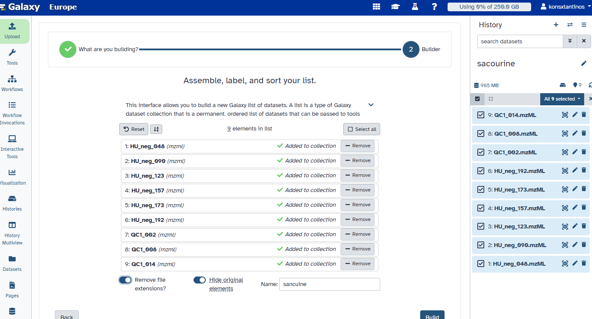

## 2: Data preparation for XCMS: MSnbase readMSData

 Launch the pre-defined workflow from tools menu typing Msnbase

we get a Dataset collection containing 9 dataset. The datasets are some RData objects with the rdata.msnbase.raw datatype.

-Before beginning to extract meaningful information from the raw data, we may be interested in visualising your chromatograms. This can be of particular interest if you want to check whether we should consider discarding some range of your analytical sequence (some scan or retention time (RT) ranges).

To do so, we can use a tool that is called *xcms plot chromatogram* tool that will plot each sample’s chromatogram (see dedicated section further). However, to use this tool, we may need additional information about your samples for colouring purpose.

Thus, we may need to upload into Galaxy a table containing metadata of our samples (a sampleMetadata file).

## 3 : Importing a sample metadata file

**:pencil2: How:** 

xcms get a sampleMetadata file

1.  **xcms get a sampleMetadata file**  tool  with the following parameters:
    -   param-collection  _“RData file”_: the  `sacurine.raw.RData`  collection output from  **MSnbase readMSData**
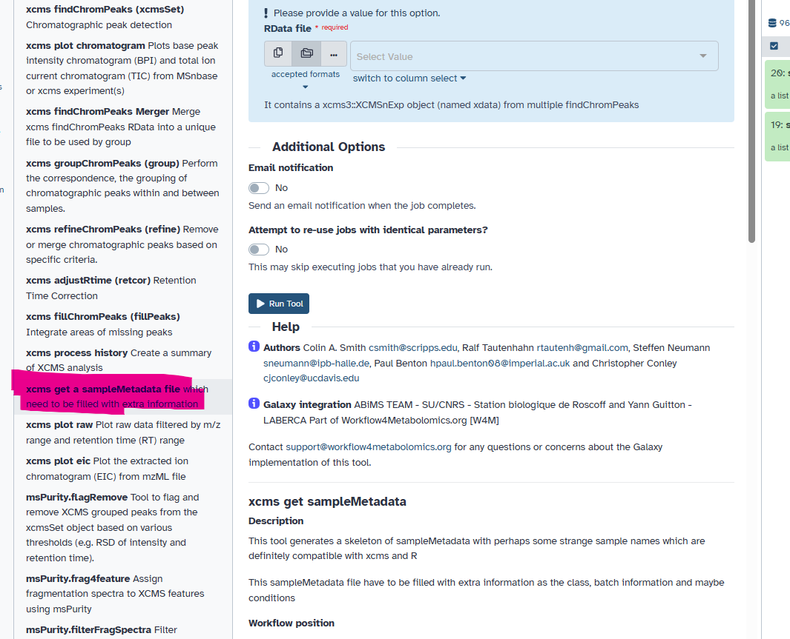
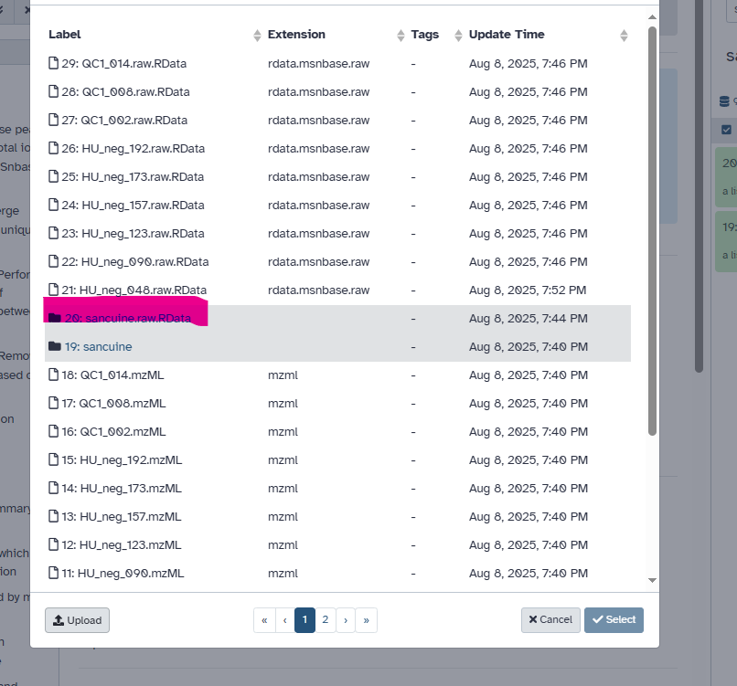

:heavy_exclamation_mark: **Comment**: 

I obtained a `tabular` file (with a first column of identifiers and a second column called _class_ which is empty for the moment (only ‘.’ for each sample). I can now download this file by clicking on the galaxy-save icon.
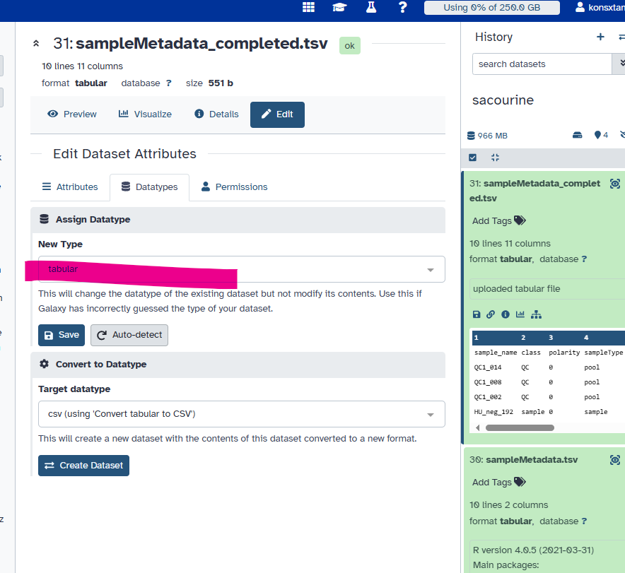

    

## 4: Getting an overview of your samples’ chromatograms

**:bulb: Goal**
 
 To  Base Peak Intensity Chromatograms (BPIs) and Total Ion Chromatograms (TICs) early on in my study

**:pencil2: How:** 

Using the tool xcms plot chromatogram

1.  **xcms plot chromatogram**  tool  with the following parameters:
    
    -   _“RData file”_:  `sacurine.raw.RData`  (collection)
    -   _“Sample metadata file”_:  `sampleMetadata_completed.tsv`  you uploaded previously
    
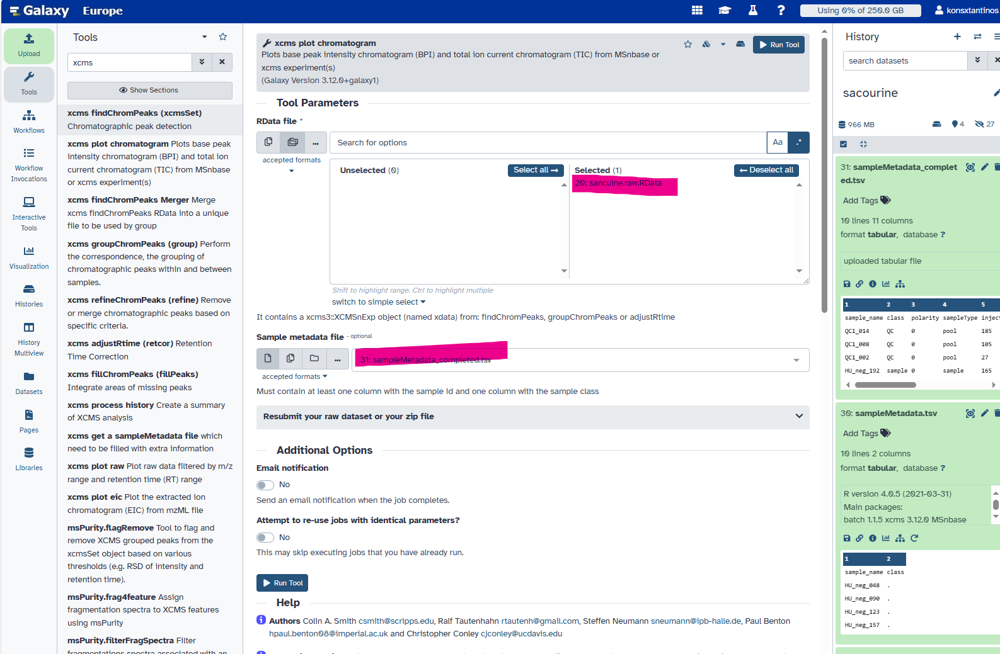

**:chart_with_upwards_trend: Output**

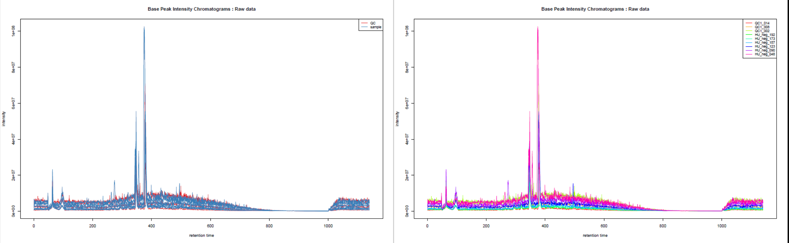

This tool generates Base Peak Intensity Chromatograms (BPIs) and Total Ion Chromatograms (TICs). I provided groups so I obtained two plots: one with colours based on provided groups, one with one colour per sample.

## 5: First XCMS Step: Peak picking
**:bulb: Goal**

Peakpicking step with the XCMS findChromPeaks (xcmsSet) tool. The idea here is, for each peak, to proceed to chromatographic peak detection/

**:pencil2: How:** 

**XCMS findChromPeaks (xcmsSet)**

1.  **xcms findChromPeaks (xcmsSet)**  tool  with the following parameters:
    
    -   _“RData file”_:  `sacurine.raw.RData`  (collection)
    -   _“Extraction method for peaks detection”_:  `CentWave - chromatographic peak detection using the centWave method`
    
    -   _“Max tolerated ppm m/z deviation in consecutive scans in ppm”_:  `3`
    -   _“Min,Max peak width in seconds”_:  `5,20`
    -   In  **Advanced Options**:
        -   _“Prefilter step for for the first analysis step (ROI detection)”_:  `3,5000`
        -   _“Noise filter”_:  `1000`

:heavy_exclamation_mark: **Comment**: 
 
XCMS provides other filtering options allowing you to get rid of ions that we don’t want to consider. For example, we can use _Spectra Filters_ allowing you to discard some RT or M/z ranges, or _Noise filter_ (as in this hands-on) not to use low intensity measures in the ROI detection step.

The XCMS solution provides two different algorithms to perform chromatographic peak detection: matchedFilter and centWave. Here we use centWave

for each of your data files independently.

1. the algorithm detects series of scans with close values of m/z. They are called ‘region of interest’ (ROI). The m/z deviation is defined by the user. The tolerance value should be set according to the mass spectrometer accuracy.

On these regions of interest, a second derivative of a Gaussian model is applied to these consecutive scans in order to define the extracted ion chromatographic peak. The Gaussian model is defined by the peak width which corresponds to the standard deviation of the Gaussian model. Depending on the shape, the peak is added to the peak list of the current sample.

2. At the end of the algorithm, a list of peaks is obtained for each sample. This list is then considered to represent the content of your sample; if an existing peak is not considered a peak at this step, then it can not be considered in the next steps of pre-processing.

## 6: Gathering the different samples in one Rdata file

**:bulb: Goal**

To merge the different `RData` files into a single one

**:pencil2: How:** 

**xcms findChromPeaks Merger**

1.  **xcms findChromPeaks Merger**  tool  with the following parameters:
    -   _“RData file”_:  `sacurine.raw.xset.RData`  (collection)
    -   _“Sample metadata file”_:  `Nothing selected`

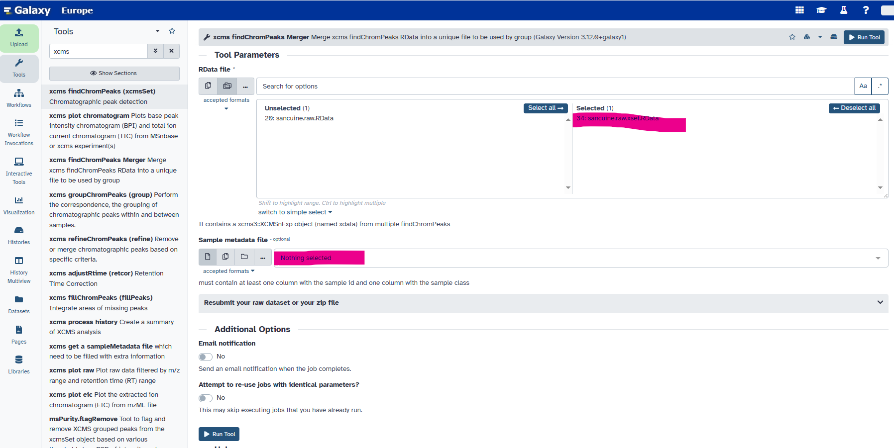

**:chart_with_upwards_trend: Output**
 
The tool generates a single  `RData`  file containing information from all the samples in your dataset collection input.

 :heavy_exclamation_mark: **Comments**: 

In the case of this study , we do not want to separate the samples according to groups, so we do not provide the sampleMetadata when executing the Merger tool.

## 7: Second XCMS step: determining shared ions across samples

 **:bulb: Goal**

We want now a single matrix of ions intensities for all samples. To obtain such a table, we need to determine, among the individual ion lists, which ions are the same. This is the aim of the present step, called ‘grouping’.

**:pencil2: How:** 

xcms groupChromPeaks (group)

1.  **xcms groupChromPeaks (group)**  tool  with the following parameters:
    
    -   _“RData file”_:  `xset.merged.RData`
    -   _“Method to use for grouping”_:  `PeakDensity - peak grouping based on time dimension peak densities`
    
    -   _“Bandwidth”_:  `5.0`
    -   _“Width of overlapping m/z slices”_:  `0.01`

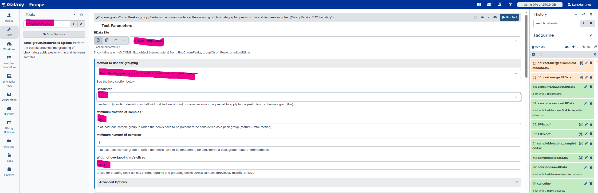

**:chart_with_upwards_trend: Output**

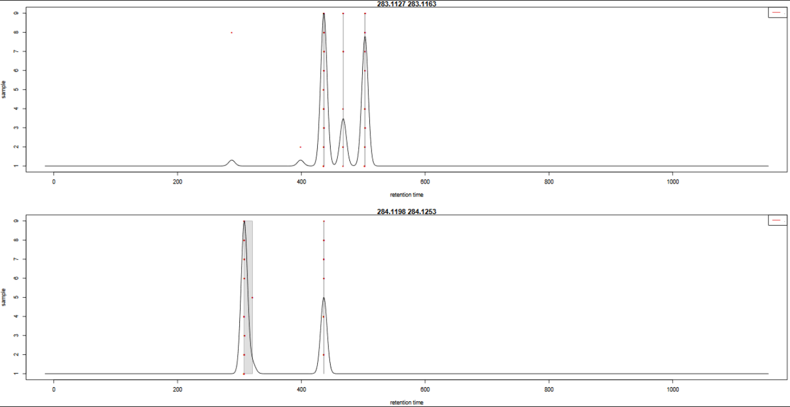

 :heavy_exclamation_mark: **Comments**: 

1.  When looking at the `283.1127 - 283.1163` m/z slice, There are 3 peak groups in this m/z slice. The two peaks that are not assigned to peak groups are alone in their retention time area. Thus, the number of samples under the corresponding density peaks does not reach the minimum fraction of samples set by the user (0.5) to consider a peak group.

3.  For  `284.1198 - 284.1253`  m/z slice, if   the bandwidth value had been set to a smaller value, the density peak width would have been smaller. With a small-enough bandwidth value, there could have been two density peaks instead of one under the current first density peak. Thus, the sample in line 5 would have been out of the previous peak group, thus not assigned to any peak group due to the 0.5 minimum fraction limit.

## 7b: XCMS step: retention time correction

 **:bulb: Goal**

To correct retention time drift for each peak among samples. The correction is based on what is called _well behaved peaks_, that are peaks found in all samples or at least in most of the samples.

**:pencil2: How:** 

xcms adjustRtime (retcor)

1.  **xcms adjustRtime (retcor)**  tool  with the following parameters:
    -   _“RData file”_:  `xset.merged.groupChromPeaks.RData`
    -   _“Method to use for retention time correction”_:  `PeakGroups - retention time correction based on aligment of features (peak groups) present in most/all samples.`
        -   _“Minimum required fraction of samples in which peaks for the peak group were identified”_:  `0.8299`
everything else is left to default values.

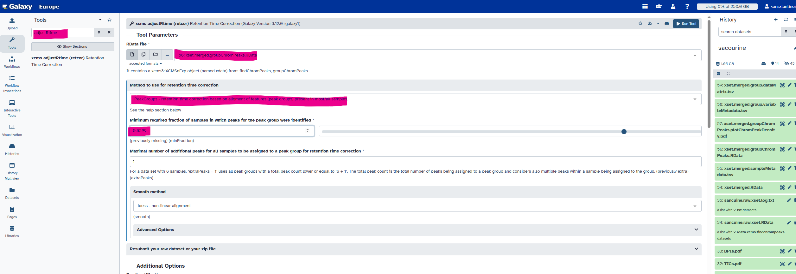

**:chart_with_upwards_trend: Output**

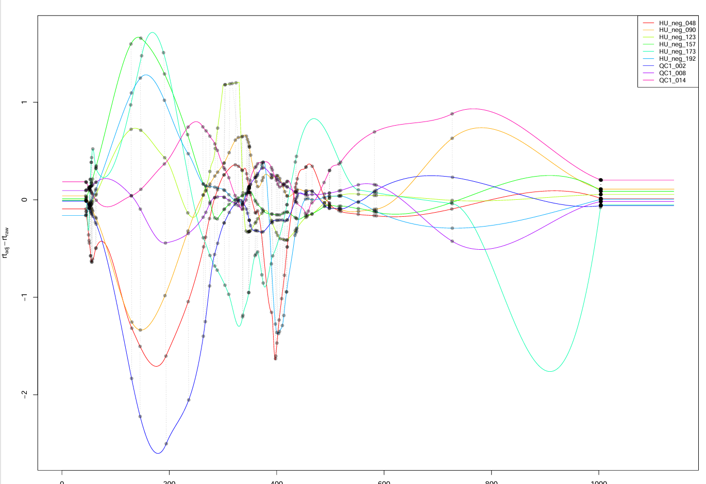

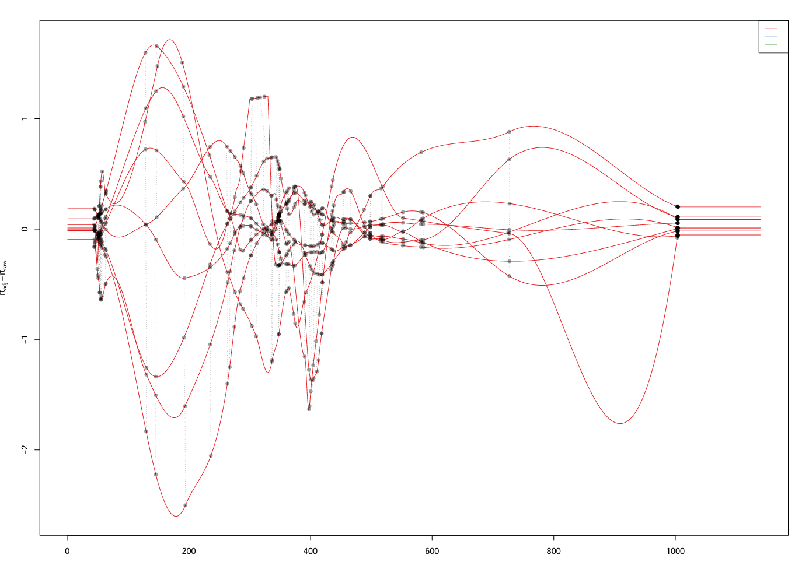

 :heavy_exclamation_mark: **Comments**: 

This tool generated a plot output that visualises how retention time was applied across the samples and along the chromatogram. It also allows you to check whether the well behaved peaks were distributed homogeneously along the chromatogram.

:heavy_exclamation_mark: **Optional**: 

the peak list may contain NA when peaks where not considered peaks in only some of the samples in the first ‘findChromPeaks’ step. This does not necessary means that no peak exists for these samples. For example, sometimes peaks are of very low intensity for some samples and were not kept as peaks because of that in the first ‘findChromPeaks’ step.

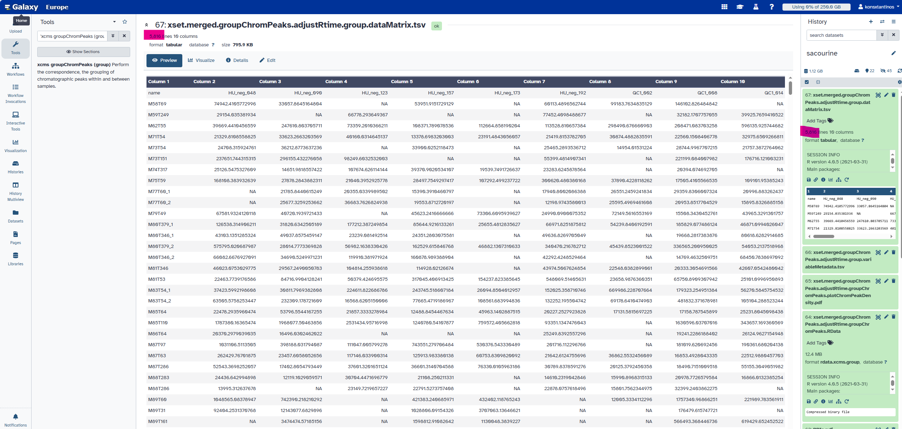

## 8: Final XCMS step: integrating areas of missing peaks

 :bulb: Goal:
 
 To integrate signal in the mz-rt area of an ion (chromatographic peak group) for samples in which no chromatographic peak for this ion was identified.

:pencil2: How: 

**xcms** **fillChromPeaks (fillPeaks)**

1.  **xcms fillChromPeaks (fillPeaks)**  tool  with the following parameters:
    -   _“RData file”_:  `xset.merged.groupChromPeaks.*.RData`
    -   In  _“Peak List”_:
        -   _“Convert retention time (seconds) into minutes”_:  `Yes`
        -   _“Number of decimal places for retention time values reported in ions’ identifiers.”_:  `2`

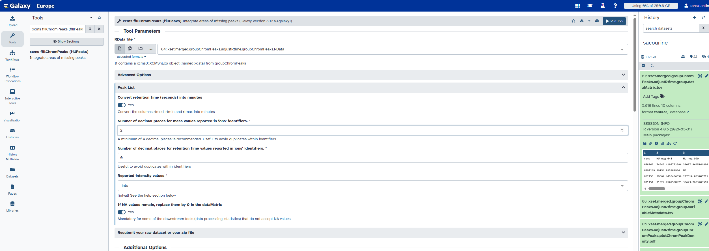

:alarm_clock: Observations: 

The  _“Reported intensity values”_  parameter is important here. It defines how the intensity will be computed. You have three choices:

-   into : integration of peaks (_i.e._  areas under the peaks)
-   maxo : maximum height of peaks
-   intb : integration of peaks with baseline subtraction

## 9 (optional) : Annotation with CAMERA R package

:bulb: **Goal**

With the **CAMERA.annotate**  tool module from CAMERA R package we perform a first annotation of our data based on XCMS outputs.

-   Polarity setting
-   For statistical analysis, we define if we have two or more conditions to compare. 
-   We can define how many significant ions will be used for extracted ions chromatogram (EIC) plot. 
- These plots will be included in a pdf file.

Apart from the PDF file, the main three outcomes from  **CAMERA.annotate**  tool  are three columns added in the variableMetadata file:

-   **isotopes:**  
-   **adduct:** this column is filled only in the ‘All functions’ mode
-   **pcgroup:**  this stands for Pearson’s correlation group; it corresponds to groups of ions that match regarding retention time and intensity correlations, leading to think that maybe they could come from the same original metabolite.

:pencil2: **How**:
1. **CAMERA.annotate**  tool with the following parameters:

-   _“RData file”_:  `xset.merged.groupChromPeaks.*.fillChromPeaks.RData`
-   In  _“Annotate Isotopes [findIsotopes]”_:
    -   _“Max. ion charge”_:  `2`
-   _“Mode”_:  `Only groupFWHM and findIsotopes functions [quick]`
-   In  _“Export options”_:
    -   _“Convert retention time (seconds) into minutes”_:  `Yes`
    -   _“Number of decimal places for retention time values reported in ions’ identifiers.”_:  `2`

:heavy_exclamation_mark: **Comment**: 

The information given by this tool is not mandatory for the next step of the metabolomic workflow. 

:heavy_exclamation_mark: **Preparation for next steps**: 

*At this step of the metabolomic workflow, I will split my analysis by beginning a new Galaxy history with only the 3 tables I need. for tidiness and for future review of the analysis process reasons. To begin a new history with the 3 tables from the current history, we use the functionality ‘copy dataset’ and copy it into a new history.*

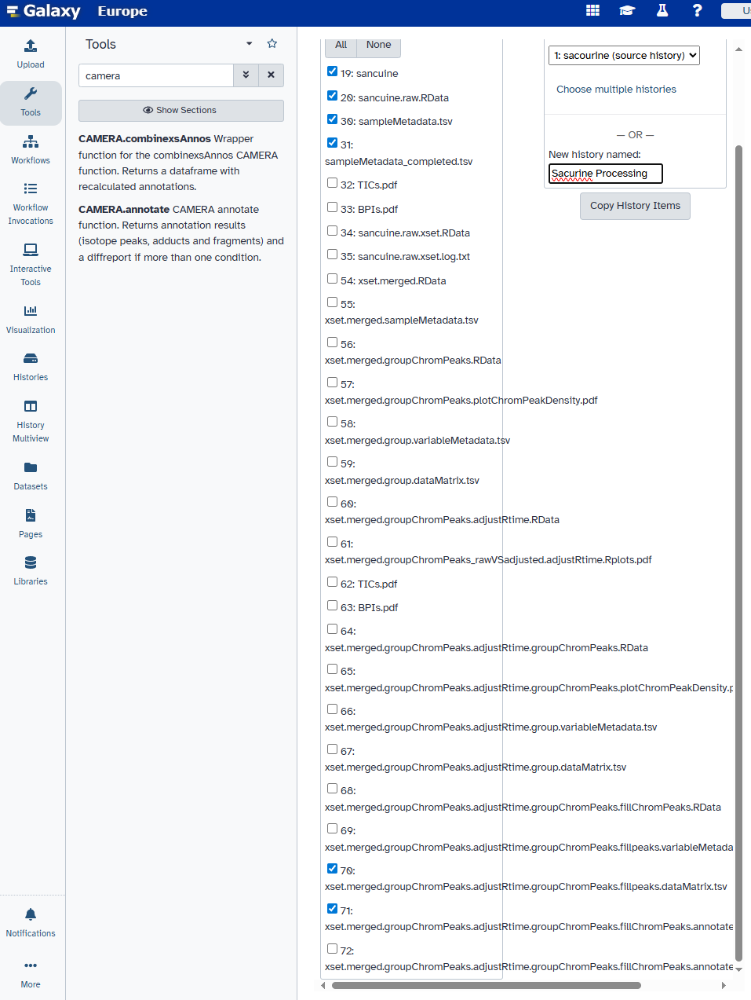

## 10. Conclusions :white_check_mark: 

At the end of the Preprocessing step, we have three tabulation-separated tables:

-   A  **sampleMetadata**  file given and completed 
-   A  **dataMatrix**  file from XCMS.fillChromPeaks
-   A  **variableMetadata**  file from either XCMS.fillChromPeaks or CAMERA.annotate

# Data processing: quality checks, normalisation, data filtering

**:notebook:Covering 3 steps:**

   
-   overview of the variability in the data
-   signal drift correction
-   filtering of unreliable variables based on coefficients of variation

## 1 :  global variability in the data

**:bulb: Goal**
Getting a complete view of such dataset  using some common unsupervised multivariate analysis.
We Used   **Principal Components Analysis** (PCA) method

**:pencil2: How:** 

Using  **Quality Metrics**  to get an overview of myhdata

1.  **Quality Metrics**  tool  with the following parameters:
    -   _“Data matrix file”_:  `dataMatrix.tsv`
    -   _“Sample metadata file”_:  `sampleMetadata_completed.tsv`
    -   _“Variable metadata file”_:  `variableMetadata.tsv`

**:chart_with_upwards_trend: Output**

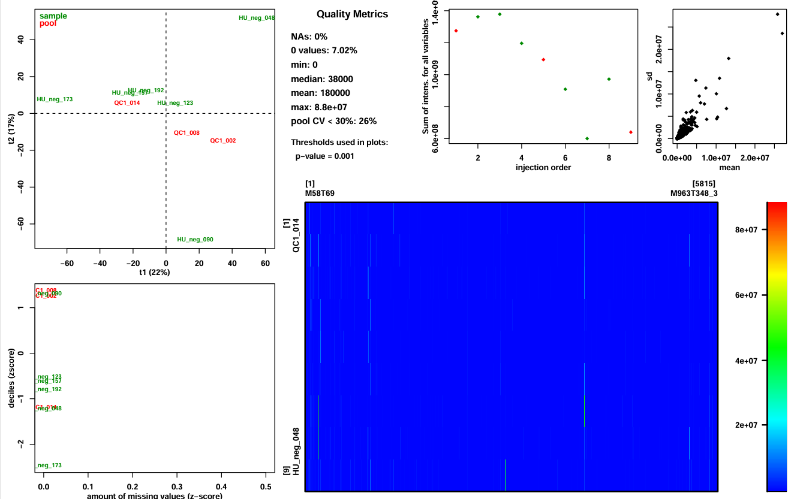

-   Summary of the intensities in the dataMatrix file (information.txt file and plot top center paragraph)
-   View of these intensities with a color scale (plot bottom right panel)
-   2-components PCA score plot to check for clusters or outliers (plot top left panel)
-   Sum of intensities per sample according to injection order to check the presence of signal drift or batch effect (plot top center panel)
-   Z-scores for intensity distribution and proportion of missing values (plot bottom left panel)
-   Ions’ standard deviation (sd) and mean values (plot top right panel)
- 
 :heavy_exclamation_mark: Comments: 

1.  We can see in the figure that the global intensity of samples seems to decrease with the injection order. We suspect a signal drift due to the clogging effect of successive injection of samples. This signal drift could be the reason why so many ions in the dataset led to high CV values for pools
2.  From identifiers on the plot, it seems that the lowest numbers in IDs are at the right side of the first component. Knowing that these numbers correspond to an order in the injection sequence, we can link it to the previous picture’s samples. Then, what we can observe is that the order of samples in the first component of PCA from right to left corresponds approximately to the decreasing order of sums of intensities. Thus, we can conclude that the main variability in the dataset may be due to the signal drift.

## 2 :  handling the signal drift observed all through the analytical sequence

**:bulb: Goal**
To normalise the data in order to get rid of unwanted variabilities due to signal drift between different sample batches/ analytical runs.
**:pencil2: How:** 
Data normalisation

1.  **Batch_correction**  tool  with the following parameters:
    -   _“Data matrix file”_:  `dataMatrix.tsv`
    -   _“Sample metadata file”_:  `sampleMetadata_completed.tsv`
    -   _“Variable metadata file”_:  `variableMetadata.tsv`
    -   _“Type of regression model “_:  `linear`
        -   _“Factor of interest “_:  `gender`

**:chart_with_upwards_trend: Output**

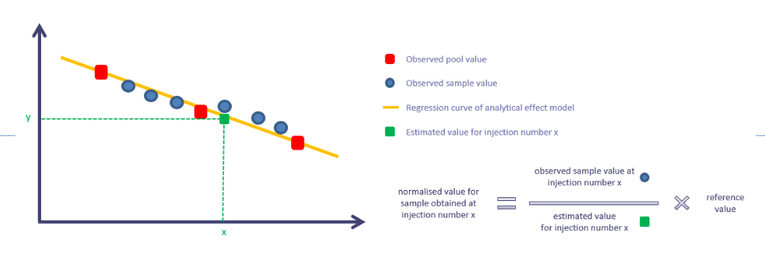

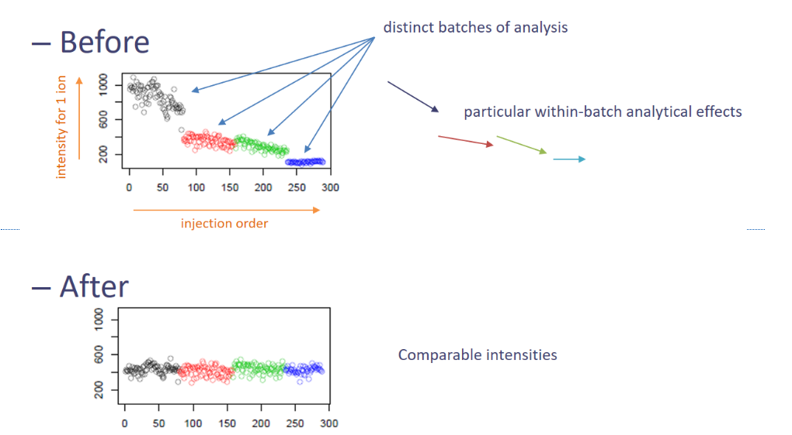

 :heavy_exclamation_mark: **Comments**: 
  In this case-study, since we only have 3 pools, there are only two possible choices: _linear_ or _all loess sample_ When possible, we should use pools to correct the signal drift, that is why we chose to run the tool with _linear_.

## 3: getting rid of unreliable variables using CV[
**:bulb: Goal**

To filter the ions not reliable enough, we can consider CVs as a filtering indicator because the data still contains unusable ions.

**:pencil2: How:** 

The  **Quality Metrics**  tool  tool provides different CV indicators depending on what is in your sample list. it can compute pool CVs  but also a ratio between pool CVs and sample CVs. This is particularly of interest since we can expect that, whatever the pool CV value, it will be lower than the corresponding sample CV value, since biological samples are supposed to be affected by biological variability. we can filter the ions that do not respect this particular condition
Hands On: CV calculation

1.  **Quality Metrics**  tool  with the following parameters:
    -   _“Data matrix file”_:  `Batch_correction_linear_dataMatrix.tsv`
    -   _“Sample metadata file”_:  `sampleMetadata_completed.tsv`
    -   _“Variable metadata file”_:  `Batch_correction_linear_variableMatrix.tsv`

 :heavy_exclamation_mark: **Comments**: 

we used this tool again, since this time indicators will be computed on normalised intensities. What we are going to use this time is the tabular output, but while we are at it we can always check the pdf file.
 
**:chart_with_upwards_trend: Output**: 

The tool provides a variableMetadata tabular output, containing all the computed CV values. We can use these values to filter our data using the **Generic_Filter**   tool.

**:pencil2: How:**: 

Data filtering

1.  **Generic_Filter**  tool  with the following parameters:
    -   _“Data matrix file”_:  `Batch_correction_linear_dataMatrix.tsv`
    -   _“Sample metadata file”_:  `sampleMetadata_completed.tsv`  or  `Quality Metrics_sampleMetadata_completed.tsv`
    -   _“Variable metadata file”_:  `Quality Metrics_Batch_correction_linear_variableMetadata.tsv`
    -   _“Deleting samples and/or variables according to Numerical values”_:  `yes`
        -   param-repeat  _“Identify the parameter to filter “_
            -   _“On file”_:  `Variable metadata`
            -   _“Name of the column to filter”_:  `poolCV_over_sampleCV`
            -   _“Interval of values to remove”_:  `upper`
                -   _“Remove all values upper than”_:  `1.0`
        -   param-repeat  _“Insert Identify the parameter to filter “_
            -   _“On file”_:  `Variable metadata`
            -   _“Name of the column to filter”_:  `pool_CV`
            -   _“Interval of values to remove”_:  `upper`
                -   _“Remove all values upper than”_:  `0.3`
    -   _“Deleting samples and/or variables according to Qualitative values”_:  `yes`
        -   param-repeat  _“Removing a level in factor”_
            -   _“Name of the column to filter”_:  `sampleType`
            -   _“Remove factor when”_:  `pool`

  :heavy_exclamation_mark: **Outcome**: 

We got rid of the pools. 
  
   :heavy_exclamation_mark: **Remarks**:
   
  1.  The  _0.3_  value corresponds to the maximum value kept in the dataset (‘Interval of values to remove:  _upper_’) regarding the  _poolCV_  column in the  _Variable metadata_  file.  pool CV values are commonly considered as reflecting unstable ions when superior to 0.3. Although the signal drift correction decreased the proportion of ions with pool CV > 30% from 74% to 53%, we still need to get rid of these remaining unstable ions for which sample comparisons would be difficult and at high risk of being unreliable.
2.  The  _1.0_  value corresponds to the maximum value kept in the dataset (‘Interval of values to remove:  _upper_’) regarding the  _poolCV_over_sampleCV_  column in _Variable metadata_  file. This means that any ion with a pool CV / sample CV ratio above 1 (_i.e._  a pool CV greater than the sample CV) is discarded from the dataset.
3.  Filtering led to 2706 ions and 6 samples.
4. Our tables are ready for the statistical analysis.

# Statistical analysis to find variables of interest
We will take the example of univariate analysis, using the `bmi` column of the **sampleMetadata file** as the study’s biological factor investigated (body mass index). Since this variable is quantitative, we will chose in this example to measure the link between the BMI and the measured ions using a **statistical correlation calculation**.

## Step 1: Computation of statistical indices
**:bulb: Goal**

To compute the correlation coefficients used to estimate the link between the biological variable `bmi` and the ions that we have in our dataset.

**:pencil2: How:** 

For this calculation we can use the  **Univariate**  tool  tool.

 1.  **Univariate**  tool  with the following parameters
      _“Data matrix file”_:  `Generic_Filter_Batch_correction_linear_dataMatrix.tsv`
       _“Sample metadata file”_:  `Generic_Filter_Quality Metrics_sampleMetadata_completed.tsv`
        _“Variable metadata file”_:  `Generic_Filter_Quality Metrics_Batch_correction_linear_variableMetadata.tsv`
        _“Factor of interest”_:  `bmi    -   _“Test”_:  `Spearman correlation rank test (quantitative)`
       _“Method for multiple testing correction”_:  `none
       
**:chart_with_upwards_trend: Output** : 

The tool provides different types of output. statistical indices in the  _variableMetadata output_  (such as p-values and statistical indicators). ‘Significant’ results are illustrated by graphics in the  _Univariate_figure.pdf_  file.
The tool also found that 61 variables have a correlation coefficient significantly different from 0.

 :heavy_exclamation_mark: **Comments**: 
 
 1. we  perform the analysis without multiple testing correction.b ased on the fact that only 6 biological samples in a dataset of 2706 ions it is almost impossible to settle for correlation coefficients significantly different from zero. 

 

## Step 2: Reducing the dataset to keep ions of interest only
**:bulb: Goal**

We will use statistical indices allowing us to determine which ions should be kept or discarded.

**:pencil2: How:** 

Variable filtering

In our example of correlation analysis, two indices can be used to filter the data.

-   **P-values:**  it indicates whether it is likely for a given correlation coefficient not to be actually different from zero; considering a threshold of 0.05 generally corresponds to a misleading risk of 5%.
-   **Correlation coefficient:**  it indicates if the correlation between a given ion and the biological factor is strong or not; it goes from -1 to 1, with 0 meaning no correlation; in our example we consider as a sufficiently strong link a coefficient with absolute value above 0.9.
1.  **Generic_Filter**  tool  with the following parameters:
    -   _“Data matrix file”_:  `Generic_Filter_Batch_correction_linear_dataMatrix.tsv`
    -   _“Sample metadata file”_:  `Generic_Filter_Quality Metrics_sampleMetadata_completed.tsv`
    -   _“Variable metadata file”_:  `Univariate_Generic_Filter_Quality Metrics_Batch_correction_linear_variableMetadata.tsv`
    -   _“Deleting samples and/or variables according to Numerical values”_:  `yes`
        -   param-repeat  _“Identify the parameter to filter “_
            -   _“On file”_:  `Variable metadata`
            -   _“Name of the column to filter”_:  `bmi_spearman_none`
            -   _“Interval of values to remove”_:  `upper`
                -   _“Remove all values upper than”_:  `0.05`
        -   param-repeat  _“Insert Identify the parameter to filter “_
            -   _“On file”_:  `Variable metadata`
            -   _“Name of the column to filter”_:  `bmi_spearman_cor`
            -   _“Interval of values to remove”_:  `between`
                -   _“Remove all values between”_:  `-0.9`
                -   _“And”_:  `0.9`
    -   _“Deleting samples and/or variables according to Qualitative values”_:  `no`

**:chart_with_upwards_trend: Output**:

In this workflow, the statistical filtering led to 25 remaining ions, linked to the BMI values by high correlation coefficients. 

 :heavy_exclamation_mark: **Comments**:
 
 With this filter we obtain a subset of our  data, supposedly ions that may present an interest regarding our study. 
In our example of correlation analysis, two indices can be used to filter the data.

-   **P-values:**  it indicates whether it is likely for a given correlation coefficient not to be actually different from zero; considering a threshold of 0.05 generally corresponds to a misleading risk of 5%.
-   **Correlation coefficient:**  it indicates if the correlation between a given ion and the biological factor is strong or not; it goes from -1 to 1, with 0 meaning no correlation; in our example we consider as a sufficiently strong link a coefficient with absolute value above 0.9.

# 4. Annotation

**:bulb: Goal**

To bring your ion’s masses and a reference mass bank face to face. This will give you potential origins of your ions.

**:pencil2: How:**

In this tutorial, we chose the easy case of human urinary samples. Thus, one possibility we have is to use the online reference bank HMDB (The Human Metabolome Database). Let’s try requesting directly into this widely used bank using the  **HMDB MS search**  tool  tool.

Annotating the data using the HMDB

 1.  **HMDB MS search**  tool  with the following parameters:>    
   _“Would you use a file “_:  `YES`>         -   _“File of masses (Variable Metadata) “_:  `Generic_Filter_Univariate_Generic_Filter_Quality Metrics_Batch_correction_linear_variableMetadata.tsv`
        -   _“Do you have a header “_:  `YES`
         -   _“Column of masses “_:  `c3`
     -   _“Mass-to-charge ratio “_:  `0.005`
     -   _“Number of maximum entries returned by the query “_:  `3`
     -   _“Molecular Species “_:  `Negatif Mode

 :heavy_exclamation_mark: **Comments**: 

We provide a Mass-to-charge ratio (_i.e._ a mass delta) based on what we globally know about the technique used to analyze the samples. Has to be set with a relevant value. If too low, no matches for the ions even though the original molecule is present in the database. Setting too high --> huge number of matches,time-consuming 
 
# 5. Conclusion

 - Data analysis in Metabolomics with LC-MS data workflow example.
   
 -  Begun to comprehend  the diversity of LC-MS metabolomic data
   analysis.
   
 -  Familiarity with the main steps constituting a metabolomic workflow
   for untargeted LC-MS analysis.
   
  - Evaluation of the potential of a workflow approach when dealing with
   LC-MS metabolomic data.
