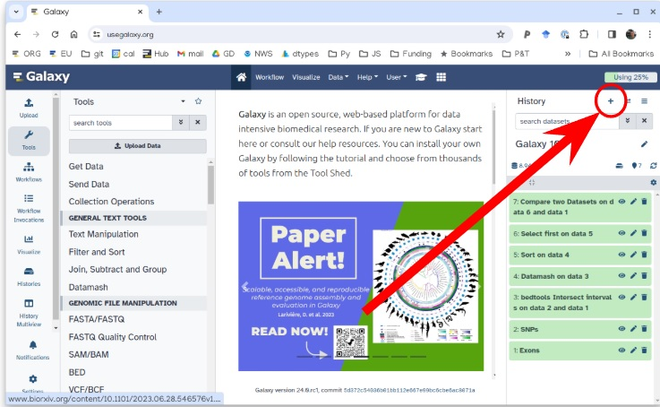

<![endif]-->

# LC-MS/MS Metabolomics Tutorial (Galaxy)

## 🔬 Project Description

This repository follows the Galaxy tutorial for LC-MS/MS-based metabolomics analysis.

The goal is to understand the processing pipeline of raw mass spectrometry data and extract meaningful biological insight.

## 📁 Folder Structure

- `raw_data/`: Raw mzML files or data obtained from the Galaxy server

- `notebooks/`: Notes, markdown files, and Jupyter notebooks

- `results/`: Output from data processing, figures, tables

## Tutorial Source

Based on the Galaxy Training Network tutorial:

👉 [LC-MS analysis (Metabolomics)](https://training.galaxyproject.org/training-material/topics/metabolomics/tutorials/lcms/tutorial.html#preprocessing-with-xcms)

## Questions:

What are the main steps of untargeted LC-MS data processing for metabolomic analysis?

How to conduct metabolomic data analysis from preprocessing to annotation using Galaxy?

## Objectives:

To comprehend the diversity of LC-MS metabolomic data analysis.

To get familiar with the main steps constituting a metabolomic workflow for untargeted LC-MS analysis.

To evaluate the potential of a workflow approach when dealing with LC-MS metabolomic data.

## Galaxy Login and History Setup

- Go to [Galaxy Europe](https://usegalaxy.eu/)

- Create an account or log in

- Create a new history: `LCMSMS Tutorial`

- 

## Step 1: Importing the lc-ms data into galaxy

-Importing via links

Copy the link location

Click galaxy-upload Upload Data at the top of the tool panel

Click on Collection on the top

Select galaxy-wf-edit Paste/Fetch Data

Paste the link(s) into the text field

Change Type (set all): from “Auto-detect” to mzml

Press Start

Click on Build when available

Enter a name for the collection

sacurine

Click on Create list (and wait a bit)

or

As an alternative to uploading the data from a URL or your computer, the files may also have been made available from a shared data library:

Go into Libraries (left panel)

Navigate to the correct folder as indicated by your instructor.

On most Galaxies tutorial data will be provided in a folder named Libraries - GTN - Material

- Metabolomics Mass spectrometry: LC-MS analysis

Click on Add to History galaxy-dropdown near the top and select as a Collection from the dropdown menu

In the pop-up window, choose

“Select history”: the history we want to import the data to (or create a new one)

Click on Import

## Step 2: Data preparation for XCMS: MSnbase readMSData

- Launch the pre-defined workflow from tools menu typing Msnbase

we get a Dataset collection containing 9 dataset. The datasets are some RData objects with the rdata.msnbase.raw datatype.

- Now that we have prepared the data, we can begin with the first XCMS extraction step: peakpicking. However, before beginning to extract meaningful information from the raw data, we may be interested in visualising your chromatograms. This can be of particular interest if you want to check whether we should consider discarding some range of your analytical sequence (some scan or retention time (RT) ranges).

To do so, we can use a tool that is called xcms plot chromatogram tool that will plot each sample’s chromatogram (see dedicated section further). However, to use this tool, we may need additional information about your samples for colouring purpose.

Thus, we may need to upload into Galaxy a table containing metadata of our samples (a sampleMetadata file).

## Step 3 : Importing a sample metadata file

- A sampleMetadata file corresponds to a table containing information about the samples (= sample metadata).

A sample metadata file contains various information for each of your raw files:

--Classes which will be used during the preprocessing steps

--Analytical batches which will be useful for a batch correction step, along with sample types (pool/sample) and injection order

--Different experimental conditions which can be used for statistics

--information about samples that you want to keep, in a column format

--The content of your sample metadata file has to be filled by you, since it is not contained in your raw data. Note that you can either:

how to Upload an existing metadata file:

Use a template to create one (because it can be painful to get the sample list without misspelling or omission)

Generate a template with the xcms get a sampleMetadata file tool tool

Fill it using your favorite table editor (Excel, LibreOffice etc.)

Upload it within Galaxy

In this Tutorial we open xcms and get a samplemetadata file from tools and load the xcms get a sampleMetadata file tool with the following parameters: param-collection “RData file”: the sacurine.raw.RData collection output from MSnbase readMSData

##From this tool, we obtain a tabular file (meaning a tab-separated text file) with a first column of identifiers and a second column called class which is empty for the moment (only ‘.’ for each sample). we can now download this file by clicking on the galaxy-save icon.

Tip: Changing the datatype

Click on the galaxy-pencil pencil icon for the dataset to edit its attributes

In the central panel, click galaxy-chart-select-data Datatypes tab on the top

In the galaxy-chart-select-data Assign Datatype, select your desired datatype from “New Type” dropdown

Tip: you can start typing the datatype into the field to filter the dropdown menu

Click the Save button

## Step 4:Getting an overview of your samples’ chromatograms

xcms plot chromatogram

xcms plot chromatogram tool with the following parameters:

“RData file”: sacurine.raw.RData (collection)

“Sample metadata file”: sampleMetadata_completed.tsv we uploaded previously

This tool generates Base Peak Intensity Chromatograms (BPIs) and Total Ion Chromatograms (TICs).

## Step 5: 1st XCMS Step

The XCMS solution provides two different algorithms to perform chromatographic peak detection: matchedFilter and centWave. Here we use centWave

for each of your data files independently.

1. the algorithm detects series of scans with close values of m/z. They are called ‘region of interest’ (ROI). The m/z deviation is defined by the user. The tolerance value should be set according to the mass spectrometer accuracy.

On these regions of interest, a second derivative of a Gaussian model is applied to these consecutive scans in order to define the extracted ion chromatographic peak. The Gaussian model is defined by the peak width which corresponds to the standard deviation of the Gaussian model. Depending on the shape, the peak is added to the peak list of the current sample.

2. At the end of the algorithm, a list of peaks is obtained for each sample. This list is then considered to represent the content of your sample; if an existing peak is not considered a peak at this step, then it can not be considered in the next steps of pre-processing.

peakpicking step with the xcms findChromPeaks (xcmsSet) tool

xcms findChromPeaks (xcmsSet) tool with the following parameters:

“RData file”: sacurine.raw.RData (collection)

“Extraction method for peaks detection”: CentWave - chromatographic peak detection using the centWave method

“Max tolerated ppm m/z deviation in consecutive scans in ppm”: 3

“Min,Max peak width in seconds”: 5,20

In Advanced Options:

“Prefilter step for for the first analysis step (ROI detection)”: 3,5000

“Noise filter”: 1000

leave the other parameters with their default values.

obtain a dataset collection containing one RData file per sample, with independent lists of ions.

To get all this files together to identify which ions are shared between samples, XCMS provides a function that is called groupChromPeaks (or group). But before proceeding to this grouping step, first you need to group your individual RData files into a single one.

## Step 6: Gathering the different samples in one Rdata file

Tool = to merge the different RData files into a single one: xcms findChromPeaks Merger

he tool also provides de possibility to take into account a sampleMetadata file. To treat part of your samples a different way when proceeding to the grouping step using xcms groupChromPeaks (group)

For example if in the analytical sequence some blank samples (your injection solvent) that you want to extract along with your biological samples to be able to use them as a reference for noise estimation and noise filtering.

xcms findChromPeaks Merger tool with the following parameters:

“RData file”: sacurine.raw.xset.RData (collection)

“Sample metadata file”: Nothing selected

Click on param-collection Dataset collection in front of the input parameter you want to supply the collection to.

Select the collection you want to use from the list

we do not want to separate the samples according to groups, so we do not provide the sampleMetadata when executing the Merger tool.

The tool generates a single RData file containing information from all the samples in the dataset collection input.

## Step 7: Second XCMS step: determining shared ions across samples

 - List item Goal: to obtain a single matrix of ions intensities for all samples.
 - This process is called grouping
 - It aligns ions extracted with close retention time and close m/z values in the different samples
 - An algorithm is used to detect region of retention time with high density of ions based on a gaussian moden the grouping is  defined by the SD of the model.
 - how:

xcms groupChromPeaks (group)

**xcms groupChromPeaks** (**group**) tool with the following parameters:

“RData file”: xset.merged.RData

“Method to use for grouping”: PeakDensity - peak grouping based on time dimension peak densities

“Bandwidth”: 5.0

“Width of overlapping m/z slices”: 0.01

<![if !supportLists]>· <![endif]>What just happened

-a pdf file is created.

-It provides one plot per m/z slice found in the data.

-Each picture represents the peak density across samples,

-plotting the corresponding Gaussian model which width is defined by the bandwidth parameter.

-Each red dot corresponds to a sample. The plot allows to assess the quality of alignment.

-he grey areas’ width is associated with the bandwidth parameter.

Observations:

<![if !supportLists]>1. <![endif]>For the 283.1127 - 283.1163 m/z slice, there are 3 peak groups. The two peaks that are not assigned to peak groups are alone in their retention time area. Thus, the number of samples under the corresponding density peaks does not reach the minimum fraction of samples set by the user (0.5) to consider a peak group.

<![if !supportLists]>2. <![endif]>For the 284.1198 - 284.1253 m/z slice,  If the bandwidth value had been set to a smaller value, the density peak width would have been smaller. With a small-enough bandwidth value, there could have been two density peaks instead of one under the current first density peak. Thus, the sample in line 5 would have been out of the previous peak group, thus not assigned to any peak group due to the 0.5 minimum fraction limit.

## Step 7b: XCMS step: retention time correction

<![if !supportLists]>· <![endif]>Goal: To correct retention time drift for each peak among samples.

-With LC-MS techniques, a deviation in retention time occurs from a sample to another.

-The correction is based on what is called _well behaved peaks_ a.k.a

a percentage of the total number of samples in which a peak should be found to be considered a well behaved peak.

-This parameter is called _minimum required fraction of samples_.

<![if !supportLists]>· <![endif]>how:

xcms adjustRtime (retcor)

**xcms adjustRtime (retcor)** tool with the following parameters:

<![if !supportLists]>o <![endif]>_“RData file”_: xset.merged.groupChromPeaks.RData

<![if !supportLists]>o <![endif]>_“Method to use for retention time correction”_: PeakGroups - retention time correction based on aligment of features (peak groups) present in most/all samples.

<![if !supportLists]>§ <![endif]>_“Minimum required fraction of samples in which peaks for the peak group were identified”_: 0.8299

<![if !supportLists]>· <![endif]>What just happened

-This tool generates a plot output that you can use to visualise how retention time was applied across the samples and along the chromatogram. -It also to check whether the well behaved peaks were distributed homogeneously along the chromatogram.

<![if !supportLists]>· <![endif]>Extra step: Tip: Check the impact of RT correction using 'xcms plot chromatogram'

How: Hands On: xcms plot chromatogram

**xcms plot chromatogram** tool with the following parameters:

<![if !supportLists]>o <![endif]>_“RData file”_: xset.merged.groupChromPeaks.adjustRtime.RData

Observations :

<![if !supportLists]>1. <![endif]>Applying the correction retention time step on the data requires to complete it with an **additional ‘grouping’** step using the **xcms groupChromPeaks (group)** tool again.

<![if !supportLists]>2. <![endif]>Parameters for this second group step are expected to be similar to the first group step. Nonetheless, since retention times are supposed to be less variable inside a same peak group now, in some cases it can be relevant to lower a little the bandwidth parameter.

<![if !supportLists]>- <![endif]>how:

second 'xcms groupChromPeaks (group)'

**xcms groupChromPeaks (group)** tool with the following parameters:

_“RData file”_: xset.merged.groupChromPeaks.adjustRtime.RData

_“Method to use for grouping”_: PeakDensity - peak grouping based on time dimension peak densities

_“Bandwidth”_: 5.0

_“Width of overlapping m/z slices”_: 0.01

_“Get the Peak List”_: Yes

_“Convert retention time (seconds) into minutes”_: Yes

_“Number of decimal places for retention time values reported in ions’ identifiers.”_: 2

_“Replace the remain NA by 0 in the dataMatrix”_: No

## Step 8: Final XCMS step: _integrating areas of missing peaks
